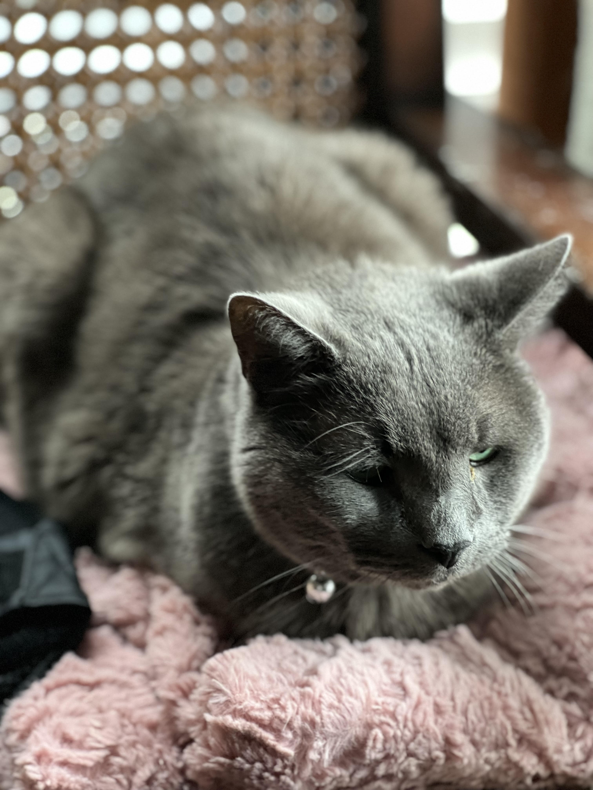
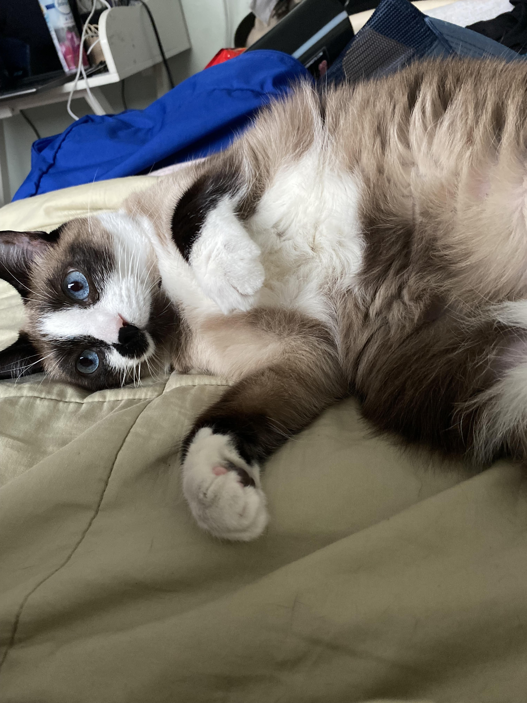
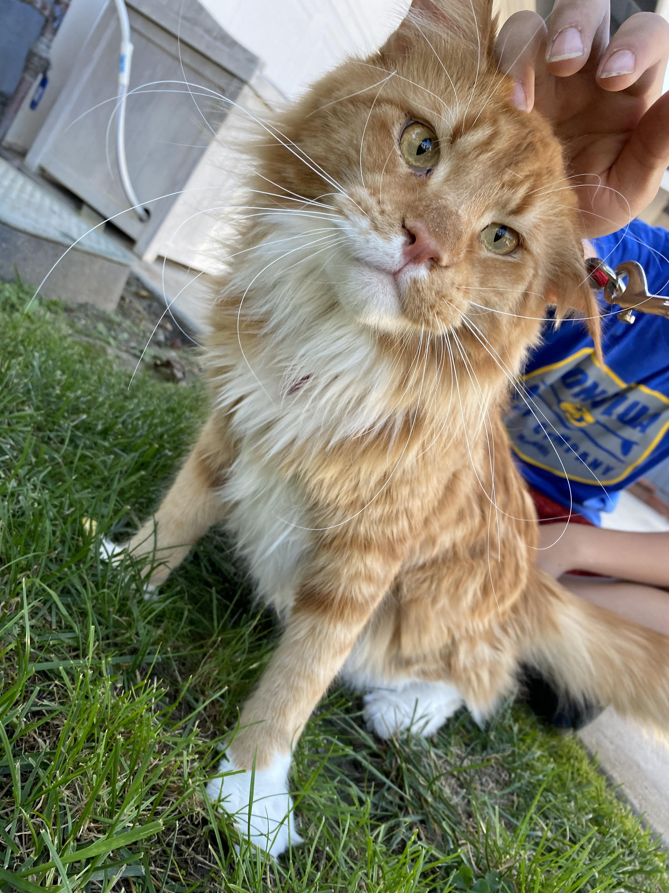
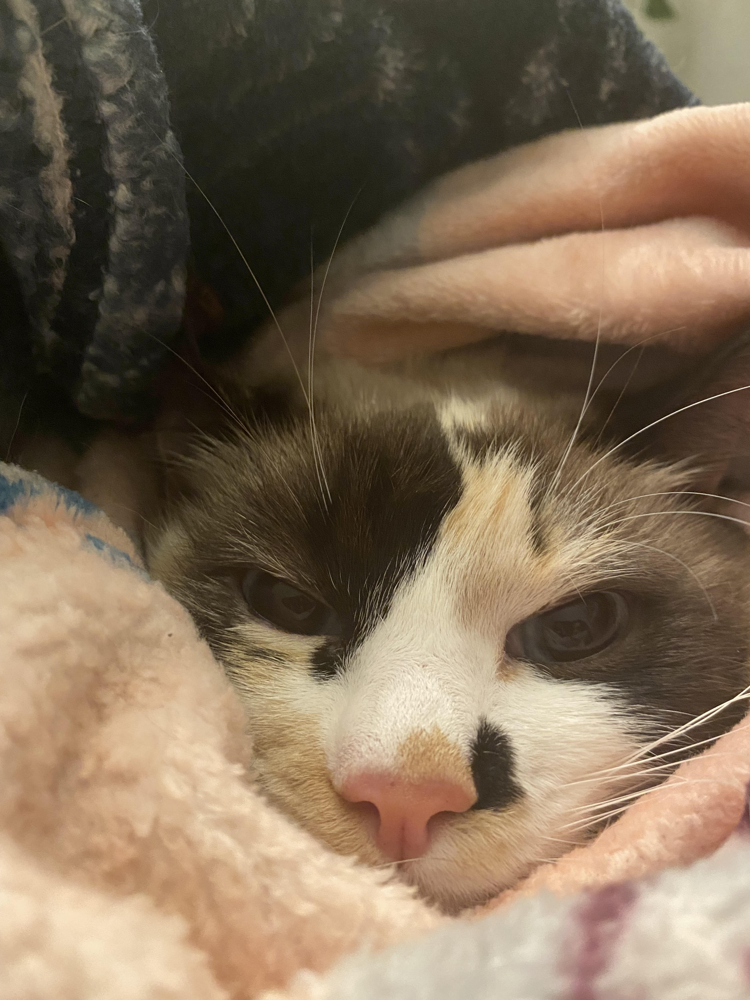
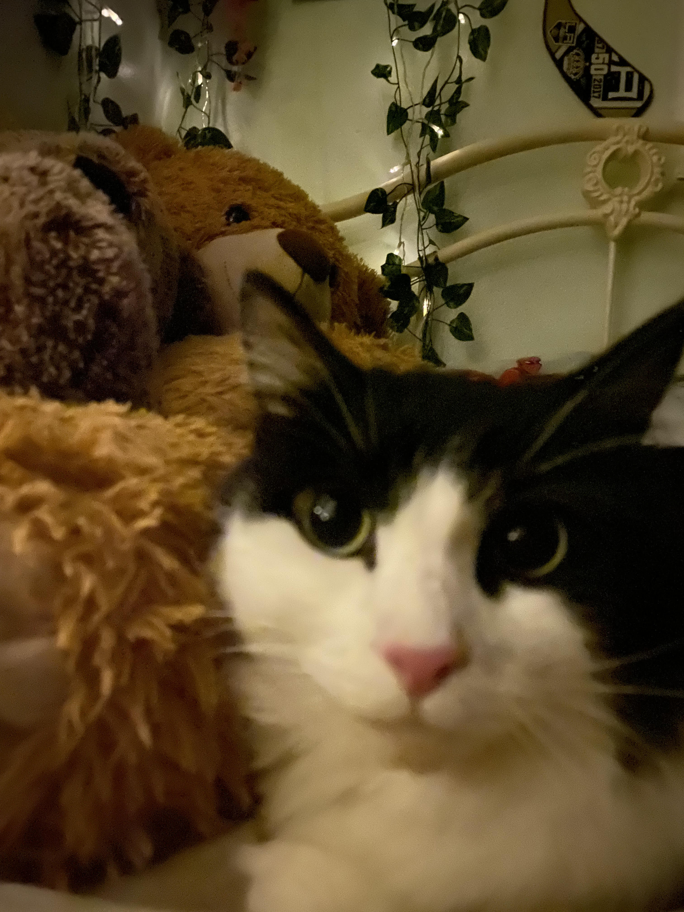
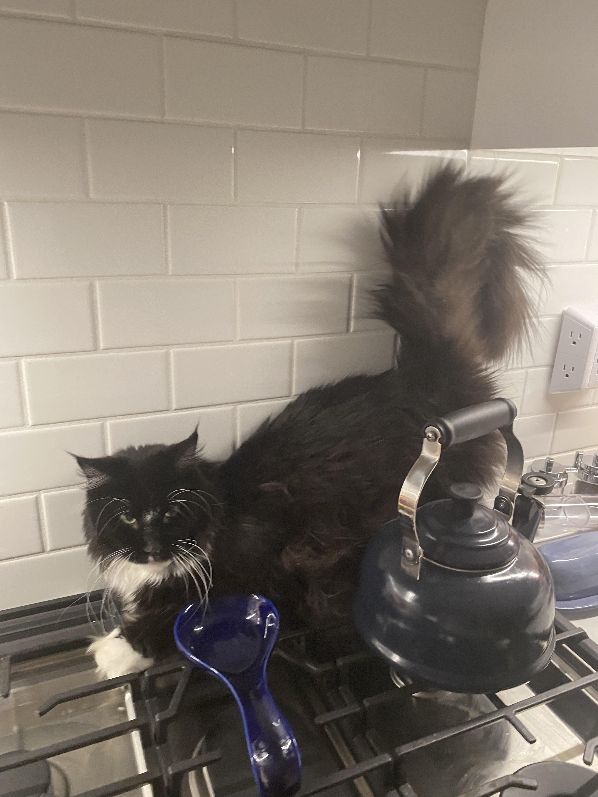
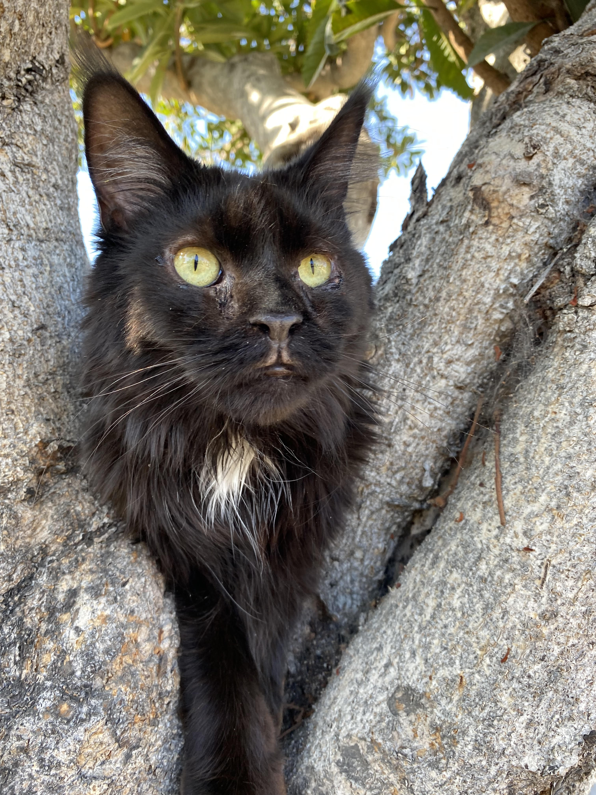
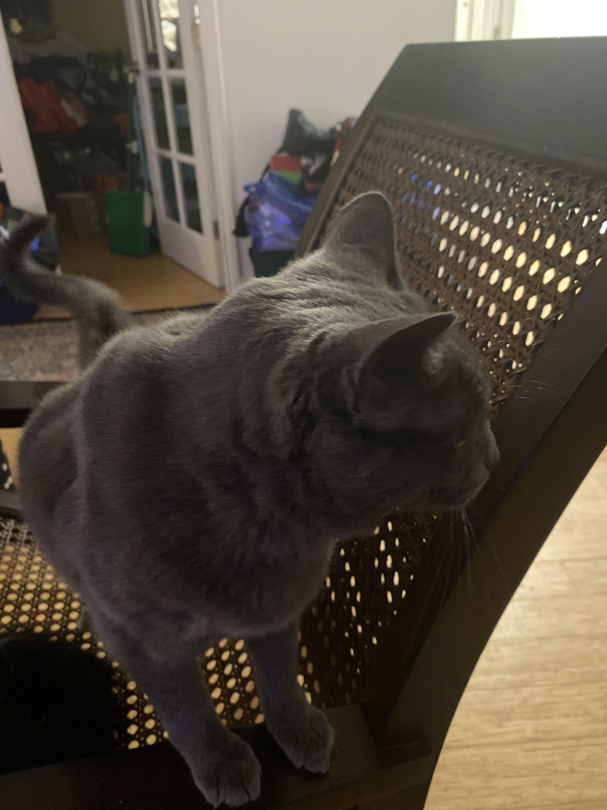
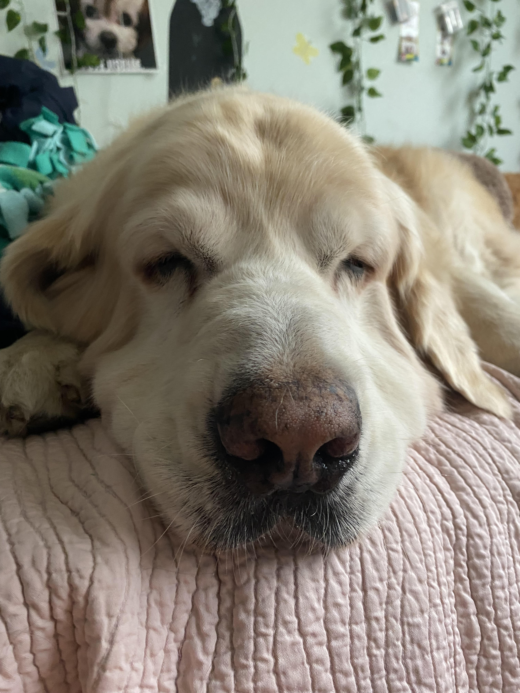
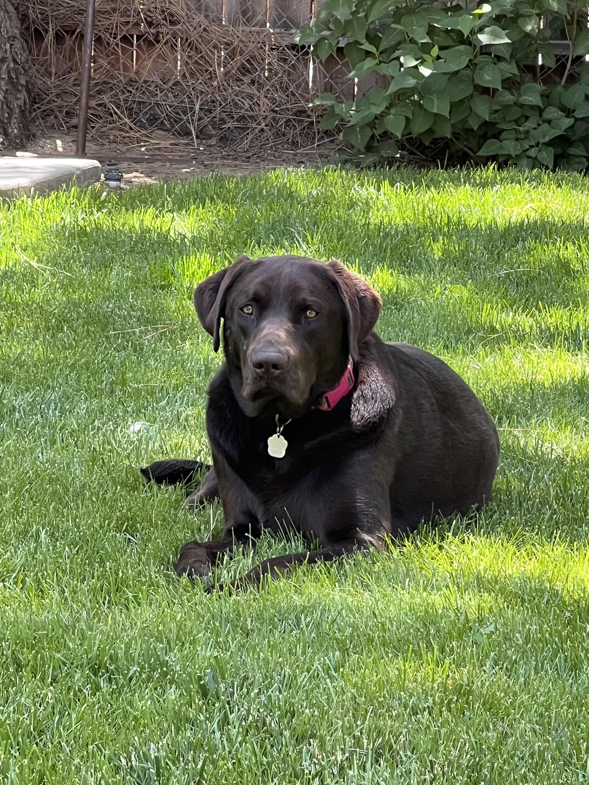

# My Pets' Website for CompSci Class
youpee! pets!
<html>
<h1>My Pets</h1>
<h2>I have 9 cats and 2 dogs and this website is about them</h2>
<body>
  

    <h2>cats</h2>
    
<strong>norman</strong>  

      
    
<strong>mimi</strong>  

      
    
<strong>oskar</strong>  

      
    
<strong>dot</strong>  

      
    
<strong>jackie</strong>  

      
    
<strong>engle</strong>  

      
    
<strong>davorian</strong>  

      
    
<strong>herbie</strong>  

      
  

  

    <h2>dogs</h2>
    
<strong>dug</strong>  

      
    
<strong>squirt</strong>  

      
  

</body>
</html>
